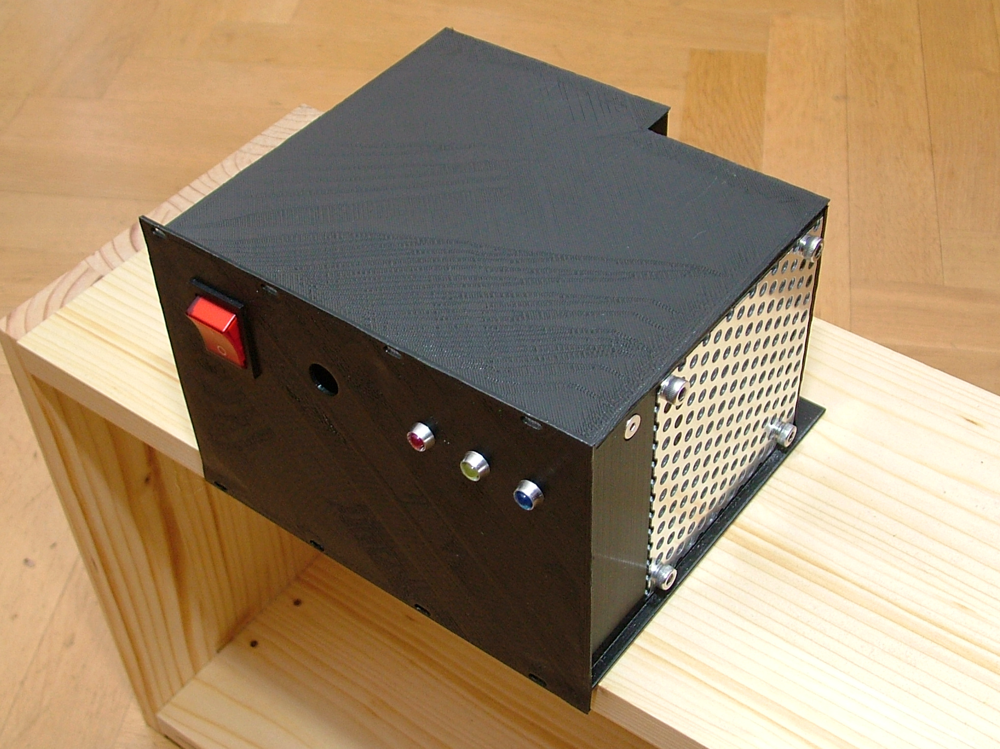
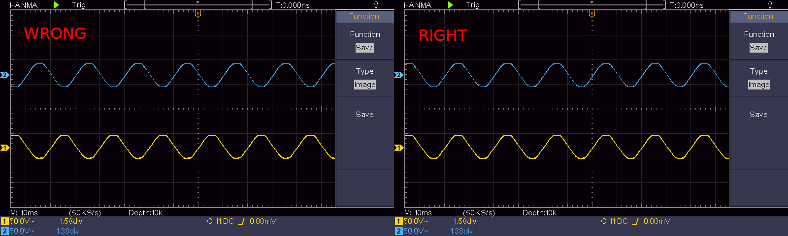
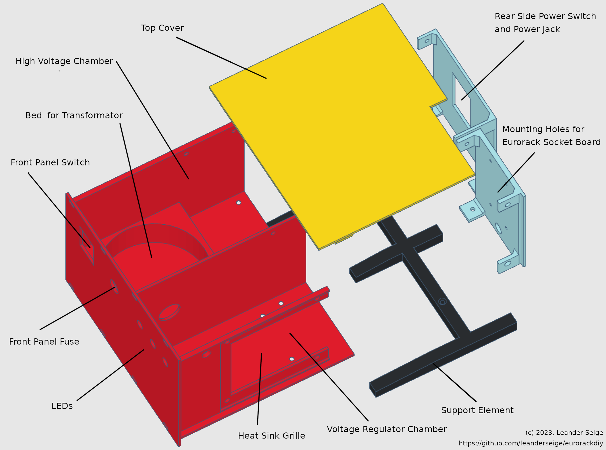

# UNFINISHED WORK IN PROGRESS

**WARNING! This device operates with high voltage. This is life-threateningly dangerous! This is a documentation. Not a manual. If you try to build a similar device, the entire risk is yours alone! If you do not feel 100% safe in handling high voltage, do not do it and buy a safe, industrially manufactured device.**

If you find mistakes or suggestions for improvement, please don't hesitate and send them my way.

# A PSU for my Eurorack

# Circuit Diagram

I chose this circuit as a basis for my power supply: https://syntherjack.net/modular-synth-power-supply/

However, I have made a few small changes. So here is the diagram of exactly my PSU:

Various Comments:

In order to get a full featured PSU I simply added a 7805 to the 12V channel to create a 5V channel. But I didn't want the 7805 to be all alone so I placed some additional capacitors around it.

I had a rectifier RS405 at hand from an old PC power supply, so I chose this one.

I did not have 1N4007 diodes but UF4007, so I used these instead.

I have one of those complete power modules that consist of a switch, a fuse and a jack and I used it for the rear side of the PSU. Of course I also added another switch for the front panel so I ended upd with two switches.

I did not feel save with just one fuse in the primary circuit so I added one in each secondary AC channel. This maybe could or should be improved by putting them on the DC outputs instead?

I was not able the get the output voltages lower than 12.7 (or -12.7) volt. So next time I probably would try a 1.5k resistor plus a 1k potentiometer. However I did not measure the PSU with load yet.

There are three control LEDs on the front panel of the power supply. I chose the colors according to the ATX standard (https://en.wikipedia.org/wiki/ATX) : yellow for +12V, red for +5V and blue for -12V.

# Transformer

In order to make sure that both secondary windings are connected in the same order
I checked using my oscilloscope. I did not confirm it experimentally but I am sure
that the secondary windings must be connected in the right phase order. The following
screenshots show the two options of the phases and I chose the right option because
I am sure that this is the only correct way to do it.

# Case

I decided to design a complete case for my PSU and manufacture it with my 3d-printer. Here is the model of it:

The case was made to be placed into a Eurorack. It is divided into two chambers: the first one contains all the high voltage elements and the transformator while the second one houses the voltage regulator board. Outside the case is a niche for a small PCB with up to three 16pin sockets. There is also a rectangluar window for a grille of 10cm x 10cm to let warm air escape.

The high voltage chamber has a round bed for a toroidal transformer.

# What would I change if I would build this a second time?

- Make the right side read wall one millimeter thicker so it does bend less wenn plugin/unplugin the power cord.
- I didn't need the hole for the front panel fuse, so I would close it. However, it could be useful with a different design.
