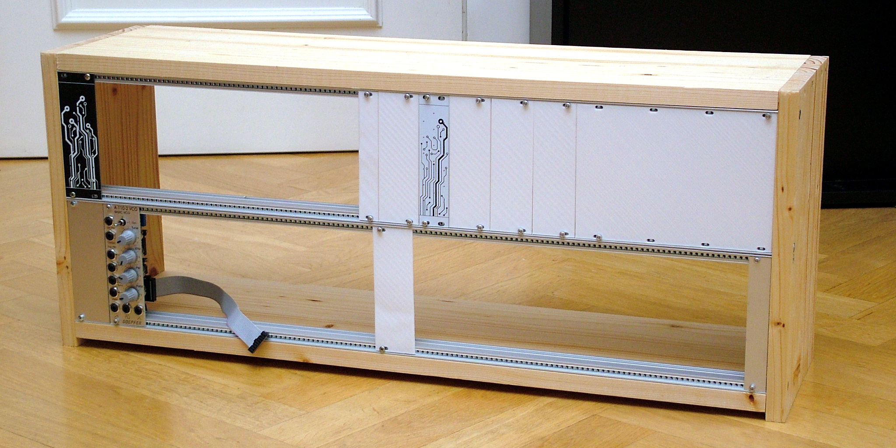
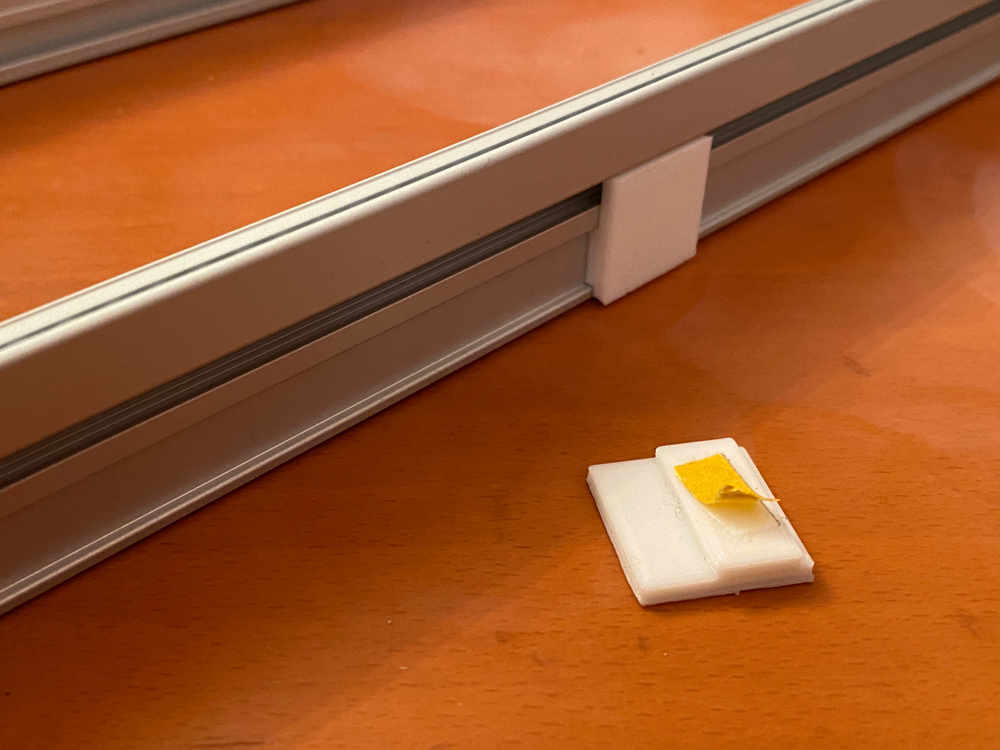
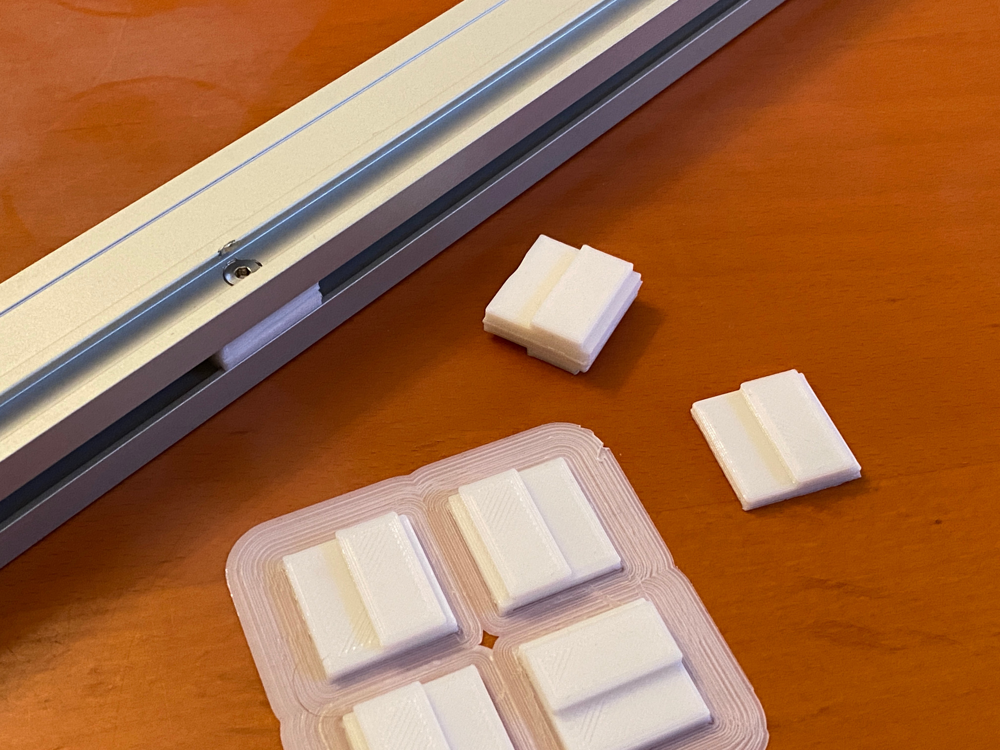
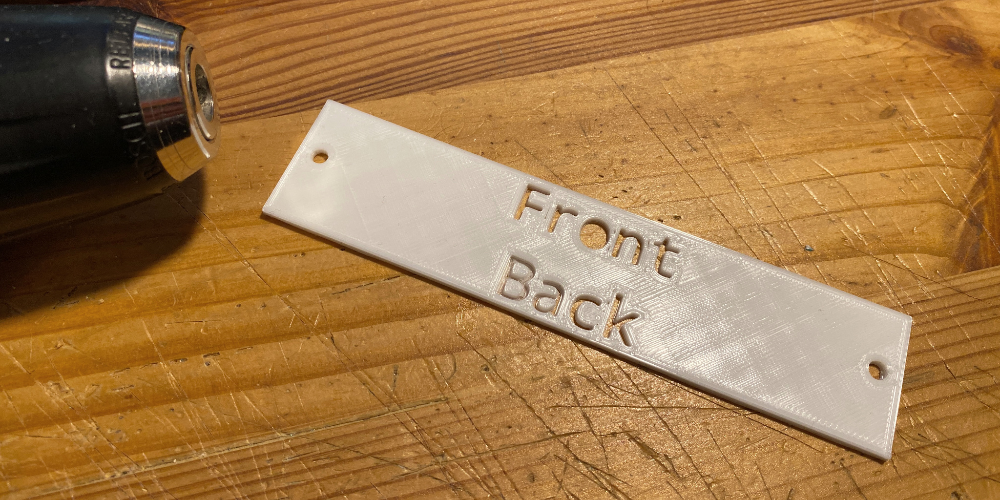

# Eurorack DIY

After experimenting with homemade synthesizers and some industrially made musical instruments, I'm now starting to build and use modular synthesizers. In this repo I document how building my own DIY Eurorack is evolving and share some files that might help others.

## Case

My first step was to measure the available space for my Eurorack: 76cm. Subtracting 2x 18mm for the vertical walls of the case, I had space for two stories of 142HP (722mm) each.

Wood: Spruce, 18mm; horizontal: two pieces 722mm x 200mm and vertical: two pieces 310mm x 200mm (slightly higher than required for "feets" on the left and on the right side)

I it was the first time that I oiled wood with special wood oil (https://amzn.to/3VLArCw). And this went really well. The oil has no smell at all, so I could do it comfortably inside without annoying anyone.

I ordered four rails 142HP (722mm) from Modular Synth Lab (Haarlem/NL) incl. threaded strips (no loose nuts). The rails seem to comply with the common rail profile (19" Trägerprofil) from Gie-Tec, which unfortunately can't be aligned with a flat surface because it will tilt. Therefore I designed small supporting elements and printed them with my 3D printer. Find them in the 3D models folder as file [railsupports.stl](3dmodels/railsupports.stl).

In order to drill perfectly positioned holes for the main skrews I designed a drill template. Find it in the 3D modles folder as file [drilltemplate.stl](3dmodels/drilltemplate.stl). Should work with the mentioned profiles from or compatible with the ones from Gie-Tec.

I bought two modules and blank panels from Doepfer and Modular Synth Lab in order to make sure that my rack will definitely comply with the specifications. Additionally I tried several 3d models of blank panels from thingiverse but to my surprise all of them did not match the industrially ones and so did obviously not comply with the specifications. Maybe people changed measures to match individual behaviour of their printers? However, I finally designed my own blank panel which comply with the specifications in almost all cases (when printed with my Anycubic i3 Mega S/Pro). I just made them an 10th millimeter longer so they are exactly the same length as the ones from Doepfer. With my tools both are 128.6mm (instead of 128.5mm according to the specs). If you want to give my blank panels a try you find them in the 3dmodels folder as bpXXhp.stl

### Links
Eurorack Specs: https://doepfer.de/a100_man/a100m_d.htm and https://doepfer.de/a100_man/a100t_d.htm

## Power Supply

Coming next: my DIY power suppply.

Width: according to the table https://doepfer.de/a100_man/a100m_d.htm I choose a width of 36HT and  round it down to 182.5 mm.

Circuit: following https://syntherjack.net/modular-synth-power-supply/
